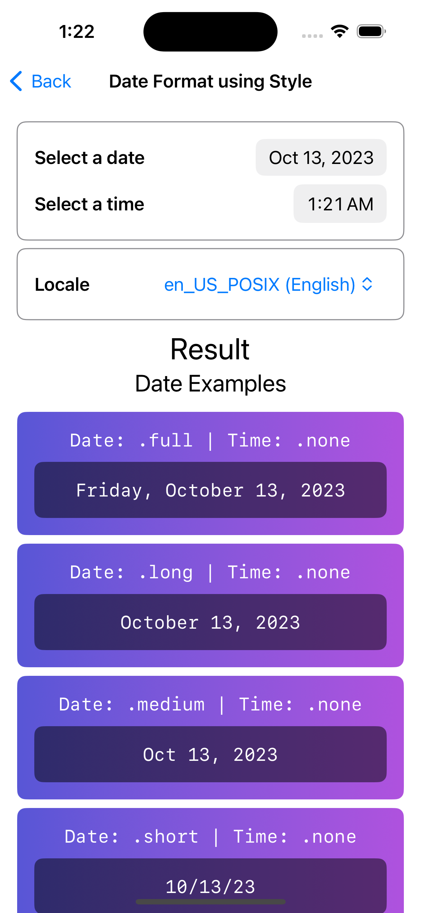
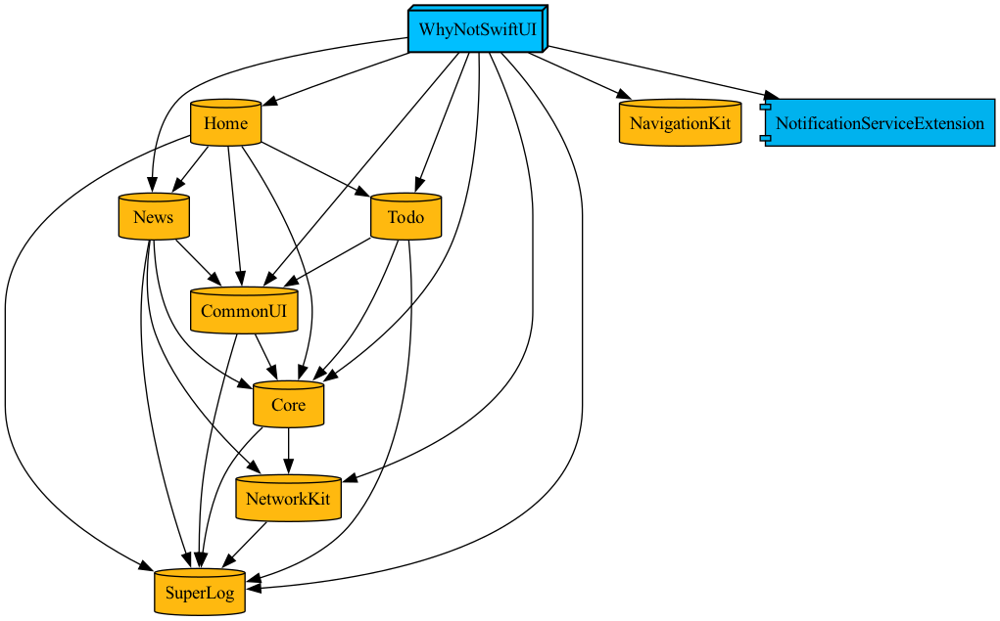

# Why Not SwiftUI!

A collection of Swift, SwiftUI and iOS goodies.

Feel free to request features or suggestions for improvements.

[](https://github.com/ImaginativeShohag)
[](https://www.buymeacoffee.com/ImShohag)
[](https://tuist.io)

## What we have hare!

### Jailbroken checker

Check for device is jail-broken status.


### Notification

Example for showing local notifications.


### Accessibility Example

Example of common accessibility modifiers.

|  |  |  |
| :-: | :-: | :-: |
|  |  |  |

### Bottom Nav vs Side Bar

A simple example to demonstrate separate views for iPhone and iPad. Users will see the bottom nav on iPhone and Sidebar on iPad.

|  |  |
| :-: | :-: |

### Component: `SuperProgress`


### Component: `SuperToast`

A cool "Android Toast" like implementation for SwiftUI.


### Component: `ImageViewCapturer`: Media Capture & Select Example

Example for capturing image, recording video and selecting media from library.


### Component: `LabelToggle`

A custom Toggle like component with inside label support.


### MetricKit crash report example

On going...

### Component: `NativeAlert`

SwiftUI modifier for `UIAlertController`. This is created to be able to change the Alert button colors.


### Component: `RingChart`


### Component: `CustomTextFieldView` with validation example


### Typography: Custom Font

Add fonts to the [project](https://github.com/ImaginativeShohag/Why-Not-SwiftUI/tree/main/Why%20Not%20SwiftUI/Resources/Fonts), add the fonts name to the [plist](https://github.com/ImaginativeShohag/Why-Not-SwiftUI/blob/main/Why-Not-SwiftUI-Info.plist) file. Finally, use [`fontStyle(size:weight:)`](https://github.com/ImaginativeShohag/Why-Not-SwiftUI/blob/main/Why%20Not%20SwiftUI/Utils/Typography.swift) to set fonts.


### Date Format Playground

Total 3 playground related to date formatting. Inspired by [NSDateFormatter.com](https://nsdateformatter.com).

|  |  |  |
| :-: | :-: | :-: |

### `ShimmerUI`

A ready to use wrapper for [SwiftUI-Shimmer](https://github.com/markiv/SwiftUI-Shimmer).

|  |  |  |
| :-: | :-: | :-: |

### Animation Examples

A collection of animation related SwiftUI features.


### UI Testing with Mock data

Checkout the "News" module to get an example for how to run an UI test using mock data.

## Playground Books

Check `Playgrounds` directory for the books.

### **GCD and Structured Concurrency Model:** A quick guide about the GCD (`DispatchQueue` etc.) and Structured Concurrency Model (`Task`, `actor`, `Sendable` etc.)

### **Combine:** An introduction guide for the Combine framework.


## Others

- Example to create preview with mock Models and ViewModels (`ObservableObject`). (See **Media Capture & Select** Example)
- Macro example (see `packages/URLMacro` directory)
    - Resources
        - [Swift Macros: Extend Swift with New Kinds of Expressions](https://www.avanderlee.com/swift/macros/)
- This project is using [Tuist](https://tuist.io). Current `Tuist` implementation has following examples:
    - Quick module add using `Module` model
    - Custom Schema
    - Custom `xcconfig`
    - Custom Build Config
    - Custom InfoPlist
- `NavController`: A ready to use navigation wrapper on top of `NavigationStack`.
- Basic example for `URLSession`
- Basic example for `Alamofire`
- Basic example for `@AppStorage`
- Basic example for `Realm`

## Project Setup

## Project Setup

This project is using [Tuist](https://tuist.io). To run the project we need some initial setup.

### Step 1: Install [mise](https://mise.jdx.dev/)

We need `mise` to install `Tuist` and for maintaining project based `Tuist` versioning.

Install `mise` CLI:

```bash
# Install CLI
$ curl https://mise.run | sh

# Check mise version
$ ~/.local/bin/mise --version
mise xxxx.x.x

# Add mise to Zsh configuration file (`.zshrc`) for auto activate mise
$ echo 'eval "$(~/.local/bin/mise activate zsh)"' >> ~/.zshrc
```
Finally, restart your shell session to use `mise`.

### Step 2: Install `Tuist`

Install `Tuist` using the following command:

```bash
mise install tuist
```

### Step 3: Clone repository and change directory to the repository

```bash
git clone git@github.com:ImaginativeShohag/Why-Not-SwiftUI.git
cd Why-Not-SwiftUI
```

### Step 4: Fetch dependencies

We need to fetch the app dependencies. So use the following command to install the dependencies from `Package.resolved` file using `Tuist`.

```bash
tuist install
```

### Step 3: Generate the project

Finally, generate and open the project using the following command:

```bash
tuist generate
```

This will generate the project file and open the project in Xcode.

### Notes

- As we are using `Tuist` to manage our Xcode project, use the following command to open the Tuist manifest files in Xcode for editing:

```bash
tuist edit
```

- We have to run the `tuist install` every time we change any dependency of our project.

- To upgrade dependency versions, use `tuist install --update` command.

- Always use `tuist generate` to open the project.

- After changing branch we also need to run the `tuist generate` command to generate project files.

- Please don't use Xcode Source Control. ([Issue](https://github.com/tuist/tuist/issues/4630))

Please see the [Tuist documentation](https://docs.tuist.io) for details.

## Run Tests

```bash
tuist test 'WhyNotSwiftUI Development' \
    --skip-test-targets NetworkKitTests/NetworkProdTests
```

## Project Map



## Directory Structure

- `Root`: Root directory
    - `ConfigurationFiles`: Configuration files
    - `CoreData`: Core Data models
    - `Entitlements`: Entitlements
    - `Targets`: Targets/Modules
        - `ModuleX`: An example target/module
            - `Resources`: Resource of `ModuleX`
            - `Sources`: Source codes of `ModuleX`
                - `Models`: All models for `ModuleX`
                    - **Note**: Keep models screen/sheet name wise.
                - `UI`: All the UI files for `ModuleX`. It also contains `ViewModel`s.
                    - `Components`: Common UI components that are shared in multiple screens
                    - `Screens`: All screens, sheets etc.
                        - `XYZ`: UI files for screen/sheet `XYZ`
                            - `Components`: Common UI components for screen/sheet `XYZ`
                                - `ABCView.swift`: Example component file
                            - `XYZScreen.swift`: Example screen/sheet UI file
                            - `XYZViewModel.swift`: Example view model file
                - `ViewModels`: Common `ViewModel`s for `ModuleX`.
            - `Tests`: Unit test target
                - `Resources`: Resource of `Tests`
                - `XYZTests.swift`: Example unit test file
            - `UITests`: UI test target
                - `Resources`: Resource of `UITests`
                - `XYZUITests.swift`: Example UI test file
        - `ModuleY`
        - `ModuleZ`
        - ...
    - `Tuist`: Tuist configuration files

# Tuist Cheat Sheet

## Access `Bundle`

**Note:** Let's assume our target name is `Core`.

```swift
/// Get current targets `Bundle` instance.
let bundle = Bundle.module

/// Get a specific targets `Bundle` instance.
let bundle = CoreResources.bundle
// Equivalent old way:
let bundle = Bundle(identifier: "org.imaginativeworld.Why-Not-SwiftUI.Core")
```

## Access Assets

**Note:** Let's assume our target name is `Core`.

```swift
// Old way
let color: Color = Color("example-color")

// New way
let color: Color = CoreAsset.exampleColor.swiftUIColor

// Old way
let image: UIImage = UIImage("example-image")! // The asset must be in the current target :(

// New way
let image: UIImage = CoreAsset.exampleImage.image // Access from any target :)
```

## TODO

- [ ] MetricKit crash report example (WIP)
- [ ] Full app custom font
- [ ] Custom Sidebar: Finalize it (WIP)
- [ ] Custom Build variant
- [ ] Add documentation to the extensions
- [ ] Home list multiple accent color
- [ ] Use system font styles
- [ ] CMS Module
- [ ] System UI Components Collection
    - [ ] (Grid)[https://developer.apple.com/documentation/swiftui/grid]
- [x] Navigation system update
- [ ] SF Symbol animation ((How to animate SF Symbols)[https://www.hackingwithswift.com/quick-start/swiftui/how-to-animate-sf-symbols])
- [x] Migrate to Tuist
- [x] Migrate to Tuist 4.0
- [ ] Fix a freeze issue in `NavigationView` inside `NavigationStack`
- [x] Add `ShimmerUI`
- [x] Update `Backend`
- [ ] Update `ShimmerUI`
- [ ] Update `Tuist` docs ("Access Assets" section etc.)

## Extensions

### `String` (`String+.swift`)

- `md5()`
- `fileName()`
- `fileExtension()`
- `isValidEmail()`
- `isBlank()`

### `Array` (`Array+.swift`)

- `commaSeparatedString(emptyValue:) -> String` : Combine string array separated by a comma.

### `UIImage` (`UIImage+.swift`)

- `fileSize() -> Int` : The file size in KB.

### `URL` (`URL+.swift`)

- `fileSize() -> Int` : The file size in KB.

# Macro

## Pre-built Swift macros:

- `#warning("message")`
- `#line`
- `#function`
- `#file`
- `#column`
- `#id` ... `#endif`
- `#filePath`
- `#colorLiteral(red: 0.292, green: 0.081, blue: 0.6, alpha: 255)`

## Licence

```
Copyright 2021 Md. Mahmudul Hasan Shohag

Licensed under the Apache License, Version 2.0 (the "License");
you may not use this file except in compliance with the License.
You may obtain a copy of the License at

    http://www.apache.org/licenses/LICENSE-2.0

Unless required by applicable law or agreed to in writing, software
distributed under the License is distributed on an "AS IS" BASIS,
WITHOUT WARRANTIES OR CONDITIONS OF ANY KIND, either express or implied.
See the License for the specific language governing permissions and
limitations under the License.
```
